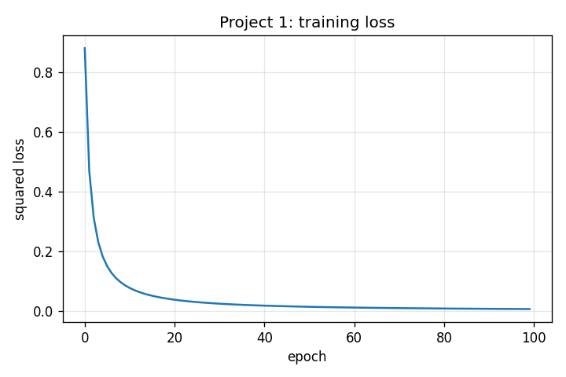

# Project 1: The Learning Machine

> Build a scalar autograd engine yourself, train a tiny MLP on a 2D toy dataset, then deliberately break the gradient flow and watch learning stop cold.

## Hook

Why does `.backward()` feel like a spell? You write a few lines of code, call one method, and somehow every weight in a network learns how to change itself. If you have been calling `.backward()` for years, the embarrassing truth might be that until you sit down to write a toy version from scratch, you cannot precisely say what is happening inside it. This project fixes that.

## The Concept

A neural network learns in three moves: it makes a guess, you measure how wrong the guess is, and then you figure out which internal numbers caused the error and by how much. That third step is the whole story — automatic differentiation, reverse-mode autodiff, backpropagation — all names for "walk the recipe backward and ask each ingredient how much of this mess was your fault."

We build:

- A `Value` class that remembers its ancestors (the **computational graph**)
- Local backward rules for each operation: `+` passes gradient straight through; `*` scales by the partner; `tanh` scales by `1 - tanh²`
- A topological sort of the graph so we can walk it backward in dependency order
- `Neuron`, `Layer`, `MLP` built on top of `Value` so the whole thing learns end to end

## Why It Matters

Without `.backward()`, training is a mystery. With it built from scratch, every odd debugging symptom — a parameter whose grad is always zero, a loss that flatlines, a weight that explodes — has a mechanical explanation you can trace.

---

## What Got Built

A complete from-scratch autograd engine in ~250 lines of pure Python (no torch, no numpy), plus a tiny MLP that learns to classify two clusters in 2D.

### Files in this folder

| File | What it is |
|------|------------|
| [`build.py`](build.py) | Complete, runnable assembly: `Value`, `Neuron`, `Layer`, `MLP`, training loop, CLI |
| [`break_it.py`](break_it.py) | Sabotage: kill the gradient flow through `__mul__`, watch loss refuse to fall |
| `step_*.py` | The book's code blocks, extracted step-by-step. Reference material — read them as you read the chapter. Not all are independently runnable; they're meant to be mentally assembled into `build.py`. |
| `tests/test_unit.py` | 18 unit tests: arithmetic, gradient correctness (vs. finite differences), accumulation rules, end-to-end convergence |

### How to run

```bash
# Proxy run — 100 epochs, takes ~3 seconds on CPU
python build.py --tiny

# Full run — 1000 epochs, ~30 seconds
python build.py --full

# Run the BREAK IT experiment
python break_it.py --tiny

# Run the tests
pytest projects/01_the-learning-machine/
```

---

## Outputs (from `python build.py --tiny`)

After 100 epochs on the toy dataset (3 points labeled −1, 3 points labeled +1), all 6 predictions classify correctly:

```
Project 1: trained 100 epochs (seed 0, lr 0.05)
  initial loss: 0.880232
  final loss  : 0.006911
  predictions:
    pred=-0.9628  target=-1.0  OK
    pred=-0.9675  target=-1.0  OK
    pred=-0.9687  target=-1.0  OK
    pred=+0.9607  target=+1.0  OK
    pred=+0.9704  target=+1.0  OK
    pred=+0.9684  target=+1.0  OK
```

### Loss curve



Textbook exponential decay. Loss drops from ~0.88 to <0.01 — a 127× improvement — while the model goes from random guessing to confident classification.

---

## BREAK IT — sabotage the gradient flow through `__mul__`

We replace `Value.__mul__`'s backward function with a no-op. Forward pass still works (predictions look normal at epoch 0), but **no blame ever flows back through any multiplication**. Since every weight is multiplied by an input somewhere, the gradients never reach the parameters.

Result of `python break_it.py --tiny`:

```
baseline              initial=0.880232  final=0.006837
broken __mul__        initial=0.880232  final=0.880203
```

The broken version's loss moves by 0.00003 over 100 epochs. The baseline's loss moves by 0.87. The forward pass is fine; the backward pass is the entire story.

**Lesson:** every weight in a neural network is multiplied by something. If `__mul__` cannot propagate gradients, nothing learns. This is why a single broken `_backward` in a custom op is a silent killer — your loss plateau is not "the model converged" or "the learning rate is wrong"; it is "no gradients are flowing."

---

## Read in the book

This project is Chapter 1 of *Under the Hood: Build Every Layer of a Large Language Model from Scratch*. Buy the book at <https://leanpub.com/under-the-hood>.

Read the chapter for the long-form derivation: why the chain rule is mechanical not magical, what the computational graph buys you, how the topological sort guarantees you do not double-count gradients, and what `+= grad` (vs. `= grad`) actually fixes.
