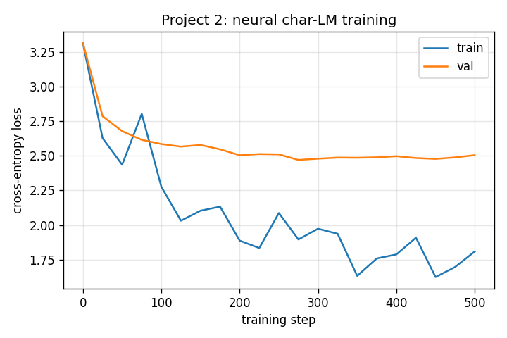

# Project 2: Predicting the Next Character

> The least mystical version of language modeling: a counting table vs. a tiny neural model with learned embeddings. Watch the neural model overfit a tiny corpus, then deliberately destroy its embeddings and see what fails.

## Hook

If a language model knows nothing about meaning, facts, or the world, why does its output still look eerily language-like? If all it does is guess one next character at a time, why does that not collapse into nonsense immediately? And if that really is all it does, what changes when you move from a dumb counting table to a neural network with learned embeddings? This project answers that by stripping language modeling down to its smallest honest form.

## The Concept

Start with the least mystical version of language generation possible: a **bigram** counting table. For every pair of adjacent characters in the training corpus, increment a counter. To generate text, look at the current character, read the matching row, turn counts into probabilities, sample.

Then upgrade: replace the explicit count table with a tiny MLP that uses **learned character embeddings** and a fixed context window of `block_size = 3` previous characters. The neural model can share statistical strength across similar characters; the counting table cannot.

## Why It Matters

Once you build both, "embedding" stops sounding abstract. It becomes a concrete row of numbers indexed by token ID, learned so that distinct inputs land at distinct internal identities. **Temperature** stops being a mysterious slider and becomes division of logits before softmax. **Cross-entropy** stops being a category in PyTorch and becomes the natural penalty for "how surprised should the model be by the actual next character?"

And — the most important lesson of this project — **baseline models are not toys**. They are sanity rails. The first time you train a neural character LM on a tiny corpus, you may find the bigram baseline ties or beats it on held-out data because the neural model overfit. That experience permanently calibrates your trust in training loss alone.

---

## What Got Built

A complete working comparison of a bigram counter and a tiny neural character LM, both training on an 80-name corpus.

### Files in this folder

| File | What it is |
|------|------------|
| [`build.py`](build.py) | Bigram counts + neural MLP with embeddings, training loop, temperature sampling |
| [`break_it.py`](break_it.py) | Collapse all embedding rows to the same vector, freeze the table, retrain |
| `step_*.py` | The book's code blocks, extracted step-by-step. Reference material. |
| `tests/test_unit.py` | 18 unit tests: vocab construction, bigram counts/probs/NLL, neural model shapes, training convergence, sampling |

### How to run

```bash
python build.py --tiny             # 500 steps, ~10s on CPU
python build.py --full             # 10000 steps, ~3 min on CPU
python break_it.py --tiny
pytest projects/02_predicting-the-next-character/
```

---

## Outputs (from `python build.py --tiny`)

```
Corpus: 80 names, vocab size 24

Bigram NLL (full corpus): 2.3337
Bigram samples: szkbubf  a  llvilrtvdhi  a  nera  chsotepruyfdia  ...

Neural model parameters: 3352
Neural after 500 steps: train_loss=1.8098  val_loss=2.5044

Neural samples at temperature 0.5: aanisley  alia  ara  daile  aaria  hanna  aula  aalia
Neural samples at temperature 1.0: sik  aha  amlovil  avdh  bella  aha  sete  ruylara
Neural samples at temperature 1.5: siklah  baoliviortvdh  belnereprhsetepruyleyi  ...
```

### Training curve



Two things are obvious from this curve:

1. **Train loss falls fast** — from ~3.2 (random) to ~1.8.
2. **Val loss falls then rises** — the canonical signature of overfitting. With only 463 training pairs, the neural model memorizes the corpus quirks.

### Bigram vs. neural

| Model | Train NLL | Val NLL |
|-------|-----------|---------|
| Bigram counts (smoothing +1) | 2.33 (on full corpus) | — |
| Neural MLP (3352 params) | **1.81** | **2.50** |

The neural model's **val loss is higher than the bigram's training loss**. On this tiny dataset, the simple baseline holds up because it cannot overfit much. This is the chapter's whole point: **trust validation loss, not training loss**. The neural model is genuinely more capable, but proving it requires either more data, less capacity, or regularization.

### Temperature sweep

Same trained model, three different sampling temperatures:

| Temperature | Behavior | Examples |
|-------------|----------|----------|
| `0.5` (cool) | Confident, repetitive, name-shaped | `alia`, `ara`, `hanna`, `aanisley` |
| `1.0` (neutral) | Mix of names and noise | `bella`, `ruylara`, `amlovil` |
| `1.5` (hot) | Long broken strings, more vocabulary | `belnereprhsetepruyleyi`, `vmnoctldvta` |

You are not changing what the model learned. You are changing how you sample from it. Temperature 0 would be argmax; temperature ∞ would be uniform.

---

## BREAK IT — destroy the embeddings, freeze the table, watch the loss plateau

We collapse every row of the embedding table `C` to be the same vector, then **freeze** `C` so gradients cannot re-introduce row distinctions. The lookup `C[X]` now returns identical vectors for every character: the model can no longer condition on which character it sees.

```
mode                     final train     final val
--------------------------------------------------
baseline                      1.8098        2.5044
collapsed embeds              2.7993        2.7817

max row-to-row difference in broken model's C after training: 0.000000
(rows stayed identical — model genuinely could not condition on character)
```

The broken model's loss plateaus around **2.78**. For comparison: uniform-random would be `log(24) ≈ 3.18`, so the model still learns the global character frequency distribution (some characters are more common at end-of-sequence than mid-sequence; that signal survives without distinguishing inputs). But it cannot do better — there is no usable information about what character it just saw.

**Lesson:** an embedding's job is to route distinct token IDs to distinct vectors. That is the entire mechanism. "Embedding represents meaning" is a one-liner that hides the work. The work is the lookup. Break the routing and the rest of the network has nothing to do.

(A subtle gotcha: if you collapse `C` without freezing it, gradients flowing back through the embedding lookup will re-introduce row distinctions within a few hundred steps. The break_it.py here freezes `C` so the sabotage is observable.)

---

## Read in the book

This project is Chapter 2 of *Under the Hood: Build Every Layer of a Large Language Model from Scratch*. Buy the book at <https://leanpub.com/under-the-hood>.

Read the chapter for: the deeper intuition behind embeddings as "rows in a notebook the model writes to itself," the negative log-likelihood derivation, why entropy and temperature are related but not the same, and the long-form Tamil-tokenization story about why one-character context is structurally inadequate for some languages.
