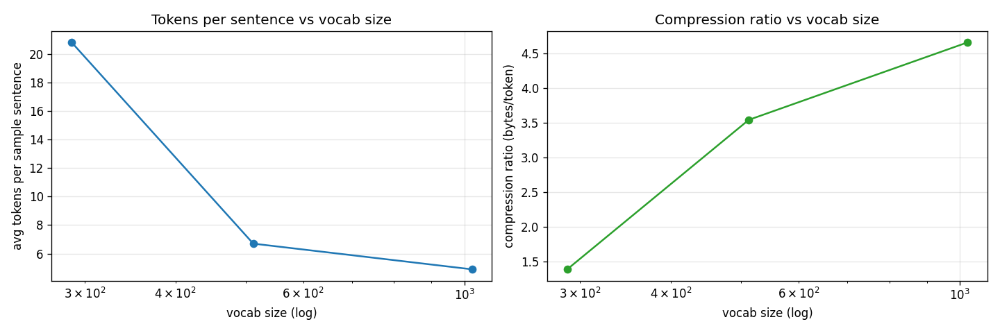

# Project 3: Building a Tokenizer

> Byte-Pair Encoding from scratch in ~80 lines. Train at multiple vocabulary sizes, visualize what gets merged, and watch the sweet spot emerge between "everything is bytes" and "everything is rare fragments."

## Hook

`tokenizer.encode("Hello, world")` is one of those calls that does a lot more than it looks like. It enforces a permanent decision: every chunk it produces becomes a "thing" the model has to learn an embedding for. If that decision is bad, the model fights the tokenizer instead of learning the data. This project peels open that decision layer and builds it from raw bytes.

## The Concept

A **BPE tokenizer** starts with the 256 possible byte values. It counts which adjacent pairs of bytes are most frequent, merges the winner into a new token ID, and repeats until the vocabulary reaches the desired size. That is the whole engine: count pairs, pick the winner, replace it, repeat.

Encoding new text re-applies the learned merges in the same priority order they were discovered. Decoding concatenates the byte sequences each token stands for. The tokenizer is just a compression scheme — but the compression units are the things the language model later predicts.

## Why It Matters

Vocabulary size is a knob nobody explains until it bites them. Too small and the model wastes context budget reassembling common chunks character-by-character. Too large and rare tokens never accumulate enough gradient signal to become useful. The sweet spot exists because two costs pull in opposite directions, and the only way to feel that tradeoff is to train at multiple sizes and look.

---

## What Got Built

### Files in this folder

| File | What it is |
|------|------------|
| [`build.py`](build.py) | BPE train/encode/decode, sweeps vocab sizes, visualizes token boundaries, plots compression curves |
| [`break_it.py`](break_it.py) | Vocab too small (256 = pure bytes) vs. too large (8192 requested) |
| `step_*.py` | The book's code blocks, extracted step-by-step. Reference material. |
| `tests/test_unit.py` | 14 unit tests: pair counting, merge correctness, train, encode/decode roundtrip on ASCII + Unicode, merge priority |

### How to run

```bash
python build.py --tiny      # sizes [288, 512, 1024], <30s on CPU
python build.py --full      # sizes [288, 512, 1024, 2048, 4096]
python break_it.py --tiny
pytest projects/03_building-a-tokenizer/
```

---

## Outputs (from `python build.py --tiny`)

Built-in corpus: 1299 bytes of mixed prose + Python code + SQL + URLs.

| Vocab size | Merges learned | Avg tokens/sentence | Compression ratio (bytes/token) | Tokens appearing once |
|------------|----------------|----------------------|---------------------------------|------------------------|
| 288        | 32             | 20.80                | 1.385                            | 5.4%                  |
| 512        | 256            | 6.70                 | 3.540                            | 33.6%                 |
| 1024 (req) | 300 (stopped)  | 4.90                 | 4.656                            | 42.5%                 |

The vocab=1024 row reveals an interesting effect: BPE **stopped early** at actual vocab=556 because no adjacent pair appeared more than once. Past that point, every further merge would just invent a one-off token glued to a single corpus position. The training loop honors the principle "only merge if the pair recurs."

### Token boundary visualizations

Same sentence, three different vocabularies:

| Vocab | Tokens for `"The quick brown fox jumps over the lazy dog."` |
|-------|--------|
| 288   | `[T][he·][q][u][i][c][k][·][b][r][o][w][n·][f][o][x][·][j][u][m][p][s·][o][v][er][·the·][la][z][y][·][d][o][g][.]` |
| 512   | `[The·quick·brown·fox·jumps·over·the·lazy·dog][.]` |
| 1024  | `[The·quick·brown·fox·jumps·over·the·lazy·dog][.]` |

(`·` shows whitespace.)

Two things are obvious from this. First, at vocab=288 the tokenizer barely improves over byte-level — common words still fragment. Second, the canonical pangram appears verbatim in the corpus, so BPE learned the whole sentence as a single token at vocab≥512. That's the "fossil" problem in miniature: an overfit chunk that won't generalize. On a real corpus this happens to rare-but-present phrases.

### Code and SQL handling

```
"def main(): user_id = 42"
  vocab=512  →  [def·][ma][in][()][:][·][user_][id·=·42]
  
"SELECT id, name FROM users WHERE active = TRUE;"
  vocab=512  →  [SELECT·id,·nam][e·][FROM·users·WHERE·][act][iv][e·=·][T][R][U][E][;]
```

BPE is not looking for words, grammar, or semantics. It is looking for **repeated adjacent byte sequences**. Hence `()`, `:`, `_id`, `=`, `;` all become reusable chunks. `SELECT id, name FROM users WHERE` becomes one token — because that prefix repeats in the corpus.

### Compression curve



Left: avg tokens per sentence vs vocab size (log x-axis). Right: compression ratio (bytes per token). Both curves drop fast then flatten — the canonical BPE sweet-spot signature.

---

## BREAK IT — vocab too small vs. too large

```
mode                       avg tokens/sent  compression     ==1freq
----------------------------------------------------------------------
baseline (vocab=512)                  6.70         3.540       33.6%
too small (vocab=256)                28.30         1.000           -
too large (req 8192)                  4.90         4.656       42.5%

(too-large requested 8192, got actual=556 after BPE exhausted pairs)
```

**Too small (vocab=256).** No merges at all. Every byte is its own token. A 45-character sentence becomes 45 tokens. The model would have to do all the work of recognizing words from their constituent bytes — context budget wasted.

**Too large (vocab=8192 requested → 556 actual).** BPE stopped early on this 1299-byte corpus because no remaining pair appeared more than once. Even at vocab=556, **42.5% of tokens used in the corpus appear exactly once**. On a real corpus this fraction wouldn't be quite that bad — but the trend is the same: pushing vocabulary size past what the corpus can support creates one-off "fossils" that won't accumulate enough gradient signal to learn useful embeddings.

**Lesson:** the tokenizer exists to manage a tradeoff, not eliminate it. Modern vocabularies land in the tens of thousands because that's the size where there are enough pieces to compress common patterns without each piece becoming statistically lonely.

---

## Read in the book

This project is Chapter 3 of *Under the Hood: Build Every Layer of a Large Language Model from Scratch*. Buy the book at <https://leanpub.com/under-the-hood>.

Read the chapter for: the full derivation of why BPE is greedy and why that's fine, the Tamil-tokenization story about why byte-level reassembly fails for complex scripts, and the long argument for why looking at your tokenizer's output by hand is the single most effective debugging habit in this stack.
