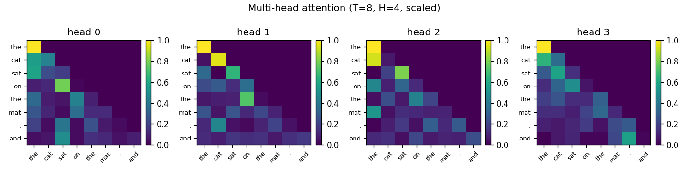

# Project 4: Attention from Scratch

> Q/K/V projections, scaled dot products, causal masking, multi-head split — all written by hand with no `nn.MultiheadAttention` to paper over what's happening. Then watch the 1/√d_head scaling factor stop being optional.

## Hook

Most published explanations of attention overweight the math and underweight the breakages. The math fits on a napkin. The breakages are where the engineering lives. This project builds attention from the inside out and then deliberately removes the scaling factor to see what fails.

## The Concept

Every token embedding gets re-expressed three ways through learned projections:

- **Q (queries)** — what each token is looking for
- **K (keys)** — what each token offers as a match target
- **V (values)** — the information to carry forward when selected

Pairwise dot products `Q @ K.T` produce a `(T, T)` score matrix. Divide by `√d_head` (so dot-product magnitudes don't grow with dimension). Mask out the upper triangle (so position `i` can only see positions `≤ i`). Softmax. Multiply by `V`. You now have a weighted mixture, per token, of every prior token's value vector.

## Why It Matters

Attention is where critical design choices live: the `1/√d_head` scaling factor, causal masking, multi-head splitting, and softmax. Each piece exists to prevent a concrete failure. The chapter argues — and this project demonstrates — that you understand each piece much better by watching what fails when you remove it than by reading about it.

---

## What Got Built

### Files in this folder

| File | What it is |
|------|------------|
| [`build.py`](build.py) | Single-head and multi-head causal attention, per-head entropy diagnostic, heatmap plotter |
| [`break_it.py`](break_it.py) | Remove the 1/√d_head scaling; watch attention entropy collapse |
| `step_*.py` | The book's code blocks, extracted step-by-step. Reference material. |
| `tests/test_unit.py` | 10 unit tests: causal mask, single-head shapes + causal zeros, multi-head row sums, entropy semantics, scaling-matters invariant |

### How to run

```bash
python build.py --tiny       # T=8 toy tokens, d_model=32, 4 heads, <1s on CPU
python build.py --full       # d_model=64, 8 heads
python break_it.py --tiny    # compare scaled vs unscaled entropy
pytest projects/04_attention-from-scratch/
```

---

## Outputs (from `python build.py --tiny`)

8 toy tokens, `d_model=32`, 4 heads, `d_head=8`. The single-head attention matrix (causal-masked, scaled, softmaxed) for these random projections:

```
[[1.000  0      0      0      0      0      0      0   ]   ← position 0 only attends to itself
 [0.547  0.453  0      0      0      0      0      0   ]
 [0.091  0.057  0.853  0      0      0      0      0   ]
 [0.171  0.155  0.645  0.028  0      0      0      0   ]
 [0.07   0.11   0.035  0.715  0.069  0      0      0   ]
 [0.449  0.037  0.061  0.198  0.183  0.072  0      0   ]
 [0.052  0.113  0.217  0.029  0.223  0.233  0.132  0   ]
 [0.023  0.097  0.244  0.049  0.061  0.175  0.257  0.094]]
```

Each row sums to 1. Everything above the diagonal is exactly 0 — the causal mask makes those positions mathematically impossible after softmax.

### Multi-head heatmaps



Four heads, each computing its own (T, T) attention matrix. These projections are random (no training), so the patterns aren't meaningful yet — but the **mechanism** is: each head can attend differently, and at training time each will specialize.

### Per-head entropy

```
Per-head mean entropy (lower = more concentrated):
  head 0: 1.047  ##########       (max possible: 2.079)
  head 1: 1.045  ##########       (max possible: 2.079)
  head 2: 1.043  ##########       (max possible: 2.079)
  head 3: 1.127  ##########       (max possible: 2.079)
```

All heads sit around half-max entropy — appropriate for random init. In a trained model, this is one of the first diagnostics you check: heads with near-max entropy are "doing nothing" (uniform attention); heads with near-zero entropy may have collapsed to one-hot. Either extreme is a sign of trouble.

---

## BREAK IT — remove the 1/√d_head scaling

Run the same attention without the scaling factor:

```
Max possible entropy per row (uniform over 8 positions): 2.079
d_head = 16 for first two rows, d_head = 64 for third

mode                                         min    mean     max
----------------------------------------------------------------------
scaled (d_head=16)                         0.974   1.078   1.179
unscaled (d_head=16)                       0.244   0.417   0.626
unscaled, d_head=64 (catastrophic)         0.184   0.208   0.258
```

Without scaling, entropy collapses by **>5×** at `d_head=64`. A representative row from the broken model:

```
[0.000  0.000  0.9925  0.000  0.000  0.0002  0.0073  0.000]
```

99.25% of the probability is on one position. That's softmax saturation. The gradient through a saturated softmax is vanishingly small for the suppressed positions, so the model **cannot learn to attend somewhere else**. Training would look fine for a few steps then plateau — exactly the symptom that the book's author describes spending hours mistaking for a learning-rate problem.

**Lesson:** the dot product `Q·K` of two `d`-dimensional vectors has variance that scales with `d`. Without `1/√d_head`, score magnitudes grow with embedding dimension, softmax saturates, gradients vanish for the unselected positions, and the model gets stuck. The `1/√d_head` factor is not cosmetic. It is structural.

---

## Read in the book

This project is Chapter 4 of *Under the Hood: Build Every Layer of a Large Language Model from Scratch*. Buy the book at <https://leanpub.com/under-the-hood>.

Read the chapter for: the long-form argument for inspecting attention matrices by hand, the masking-vs-future-leakage walkthrough using "the answer is 42", and the per-head pattern catalog (local diagonal bands, delimiter matching, identifier tracking in code) you should expect to see in trained models.
