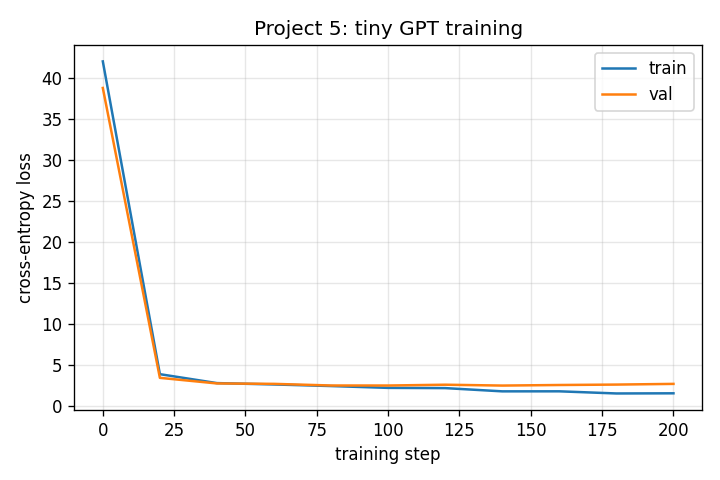

# Project 5: Your GPT from a Blank File

> The smallest complete GPT: tokenizer → batches → transformer blocks → training loop → generation, in one file. Train it on Shakespeare-shaped text in 3 seconds on CPU.

## Hook

There is a real difference between "understanding the transformer paper" and "writing a transformer from a blank file and watching the loss fall." This project closes that gap. By the end you have an end-to-end working GPT that you wrote yourself, that you can extend, that you can break, and that you can compare line-by-line with production code like nanoGPT later.

## The Concept

A GPT-style language model is a stack of identical pre-norm transformer blocks operating on token + position embeddings, with a tied LM head projecting back to vocabulary logits. Training is a tight loop: sample a batch of (input, target+1-shifted), compute cross-entropy, backprop, update with AdamW, clip gradients, repeat.

The blocks themselves are the canonical pattern:

```
x = x + attn(LayerNorm(x))
x = x + mlp(LayerNorm(x))
```

Pre-norm + residual + LayerNorm. Same recipe, repeated N times.

## Why It Matters

Once you have written this, every later GPT implementation you encounter — nanoGPT, llama, gpt-2, mistral — stops looking like wizardry and starts looking like a variation on these ~250 lines.

---

## What Got Built

A working ~250-line tiny GPT with weight tying, gradient clipping, AdamW, and autoregressive generation.

### Files in this folder

| File | What it is |
|------|------------|
| [`build.py`](build.py) | Tiny GPT + char tokenizer + batching + train loop + generation + CLI |
| [`break_it.py`](break_it.py) | Remove residual connections; loss barely budges from random |
| `step_*.py` | The book's code blocks, extracted step-by-step. Reference material. |
| `tests/test_unit.py` | 11 unit tests: tokenizer roundtrip, batching shapes + shift invariant, model forward shapes, weight tying, causal mask buffer, generation, training-converges sanity |

### How to run

```bash
python build.py --tiny      # 200 steps, ~3s on CPU
python build.py --full      # 5000 steps, ~10 min on CPU
python break_it.py --tiny
pytest projects/05_your-gpt-from-a-blank-file/
```

---

## Outputs (from `python build.py --tiny`)

Built-in Shakespeare-shaped corpus, ~50 unique characters, 2 transformer layers, 4 heads, d_model=64. About **40k parameters** after weight tying. Trains 200 steps in 3 seconds on CPU.

```
Corpus: 1872 chars, vocab_size=45
Train tokens: 1684  Val tokens: 188
Model parameters (after weight tying): ~39872

Training for 200 steps ...
Final: train_loss=1.5735  val_loss=2.7224  (uniform would be log(vocab)=3.8712)
```

Train loss falls from ~3.9 (random) to ~1.6 — the model has clearly learned **something** about character distributions. Val loss is higher than train (overfitting on the tiny corpus, same pattern as Project 2). With `--full` the val loss continues to drop for a while before plateauing.

### Loss curve



Sharp early drop, then asymptotic improvement. This is the standard signature of a tiny LM on a small corpus.

### Sample generations after `--tiny` training

```
First Citizen:
First, wene song wethatins obes ves pearopiceeresoo s tingslct ct; hinsth?
Rmest aelakSe to tilla s'sped ke kne hary ver
----------------------------------------
First Citizen:
No pecoure wecitay, anow e, ak.
Second Citizen Car tolititizen:
etid wicitizensons wice, Couldied, cius wol he'ty; cthe
----------------------------------------
```

Not coherent English, but **recognizably Shakespeare-shaped**: the speaker tags `First Citizen:`, `Second Citizen:`, the colon-newline structure, the apostrophes, the character set. The model has learned the **format** of the corpus before it has learned grammar.

After `--full` (5000 steps) the samples become substantially more readable — multi-word phrases like "we'll have corn at our own price" appear because the corpus is small enough to nearly memorize.

---

## BREAK IT — remove the residual connections

The standard transformer block is:

```python
x = x + attn(LayerNorm(x))    # ← that "+ x" is the residual
x = x + mlp(LayerNorm(x))     # ← and that one
```

What happens if we replace those with the raw sublayer output?

```python
x = attn(LayerNorm(x))   # no residual
x = mlp(LayerNorm(x))    # no residual
```

```
Uniform baseline (random guessing): 3.8712

mode                          final train     final val
-------------------------------------------------------
baseline (residual)                1.5735        2.7224
broken (no residual)               2.8488        2.8053
```

The broken model's train and val are essentially equal — about 1 nat above the baseline. It's barely better than uniform random. **Without the residual, the random init of the first sublayer wipes out the signal before training can do anything useful** — and stacking more layers compounds the destruction.

**Lesson:** the residual connection is not a small optimization. It is the architectural reason transformers can be deep. Each sublayer learns a **correction** to the running representation; without the "+x" the sublayer becomes a replacement, and a randomly-initialized replacement destroys whatever the previous layer expressed.

---

## Read in the book

This project is Chapter 5 of *Under the Hood: Build Every Layer of a Large Language Model from Scratch*. Buy the book at <https://leanpub.com/under-the-hood>.

Read the chapter for: the full Karpathy-style derivation of the batch sampler (and the "honest indexing" rule when concatenating documents), the weight-tying derivation, the gradient-clipping intuition, the LR warmup/cosine schedule discussion, and the "how to read a checkpoint" walkthrough — none of which are reproduced in this minimal repo version.
