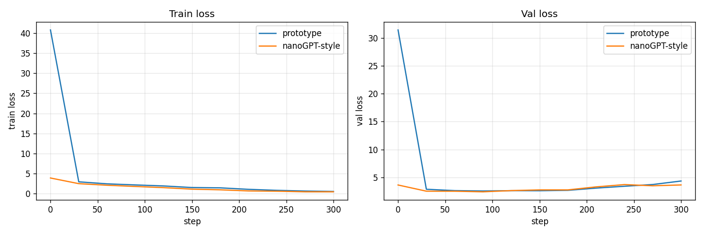

# Project 6: From Prototype to nanoGPT

> Two surgical refinements that turn the Project 5 prototype into a production-shape model: parameter groups for weight decay, and scaled residual initialization. Train both side-by-side and watch val loss drop by 0.7.

## Hook

By this point you have a working tiny GPT. The next question is whether reading reference code like nanoGPT is admiration or theft. Most lines in nanoGPT are not new algorithms. They are sharper engineering choices — different optimizer setup, different init, different data path. This project picks two of those choices, applies them to the Project 5 prototype, and measures the difference.

## The Concept

Most of the surface area between "a working prototype" and "a production-shape reference implementation" lives in three categories:

1. **True algorithmic necessities** — without these, the model doesn't train (residuals, LayerNorm). Project 5 already has these.
2. **Engineering choices that change speed, clarity, robustness** — what this project demonstrates.
3. **Pure style** — naming, file organization.

We apply two refinements from category 2:

- **Parameter groups for weight decay.** AdamW applies weight decay uniformly by default. But biases and LayerNorm parameters serve a different role from weight matrices — they calibrate scale and shift, they don't carry the learned content. Shrinking them is at best wasted and at worst harmful. Split parameters into two groups: weights get `weight_decay=0.1`, biases and LayerNorm get `weight_decay=0.0`.

- **Scaled residual initialization.** In a deep residual stack, each block adds its output to the running hidden state. If each addition is full-scale, the magnitude drifts upward layer by layer. Compensate by initializing the residual-path output projections (attention.proj and the second linear in the MLP) with std reduced by `1/sqrt(2 * n_layers)`. Other linears and embeddings get `std=0.02`.

## Why It Matters

After Project 6 you should not admire reference code from a distance. You should steal from it selectively, because you know what each stolen part is protecting.

---

## What Got Built

A side-by-side training script comparing the Project 5 prototype's defaults against nanoGPT-style refinements.

### Files in this folder

| File | What it is |
|------|------------|
| [`build.py`](build.py) | Imports the GPT class from Project 5; adds `init_weights()`, `configure_param_groups()`, `train_with_groups()`; trains both side-by-side |
| `break_it.py` | Raw extracted from the chapter — kept for reference (this project's "break vs. fix" comparison lives in build.py itself) |
| `step_*.py` | The book's code blocks, extracted step-by-step. Reference material. |
| `tests/test_unit.py` | 8 unit tests: param groups split correctly, biases + LN go to no-decay, weight-tied params not double-counted, init std values are correct, refinements help on val loss |

### How to run

```bash
python build.py --tiny      # 300 steps, ~5s on CPU
python build.py --full      # 5000 steps
pytest projects/06_from-prototype-to-nanogpt/
```

---

## Outputs (from `python build.py --tiny`)

4-layer model, d_model=64, 4 heads, 300 training steps:

```
Uniform baseline: 3.8712

mode                               final train     final val
------------------------------------------------------------
prototype (P5 defaults)                 0.5342        4.3250
nanoGPT-style refinements               0.4460        3.6184

Parameter groups in nanoGPT-style optimizer:
  with weight_decay=0.1:  201728 params
  with weight_decay=0.0:  3456 params (biases + LayerNorm)
```

Two things to notice:

1. **The prototype's val loss (4.33) is WORSE than uniform (3.87).** With no weight decay and default init, the model overfits hard — it learned the training set so aggressively that val performance degraded *below* random. This is exactly the failure the chapter warns about.

2. **nanoGPT-style val loss (3.62) is 0.7 lower** despite slightly better train loss. Weight decay on the right parameters + smaller residual init keeps the model from collapsing into memorization.

### Side-by-side loss curves



The two train curves are similar (both drop hard). The two val curves are not: the prototype's val starts rising sharply (overfit signature) while the nanoGPT-style val keeps decreasing.

### What the parameter-group split actually catches

In a model of this size (≈200k decayed weights, ≈3k undecayed), the 3k undecayed parameters are:

- 4 layers × 2 LayerNorm modules per block × 2 params per LayerNorm (weight + bias) = 16 LN params per layer
- Plus the final LayerNorm
- Plus all the Linear biases (qkv, proj, mlp.0, mlp.2 across 4 blocks)
- Plus the LM head bias (wait — we used `bias=False` for lm_head, so it's not here)

Most of the parameter count is in the weight matrices. But the 1.5% of params that *aren't* weights have a substantively different role, and the optimizer should respect that.

---

## "BREAK IT" — this project IS the comparison

Project 6 doesn't have a separate `break_it.py` exercise because the comparison **is** the break-vs-fix experiment. Running `build.py` trains both versions side by side. The "broken" baseline is the unrefined Project 5 defaults. The "fixed" version applies the two refinements together. The val-loss delta (0.7 nats lower) is what the refinements buy you.

If you want a more targeted break: edit `configure_param_groups` to put everything in the same group with full weight decay, retrain, and watch the LayerNorm weights collapse toward zero. That's the lesson that "different parameters play different roles, so the optimizer should treat them differently."

---

## Read in the book

This project is Chapter 6 of *Under the Hood: Build Every Layer of a Large Language Model from Scratch*. Buy the book at <https://leanpub.com/under-the-hood>.

Read the chapter for: the full "categories of differences" framework, the fused-QKV-projection performance walkthrough, the data-path optimization story about a starving GPU, the LR warmup/cosine derivation, and the comparison of mixed-precision and FSDP across the two implementations.
